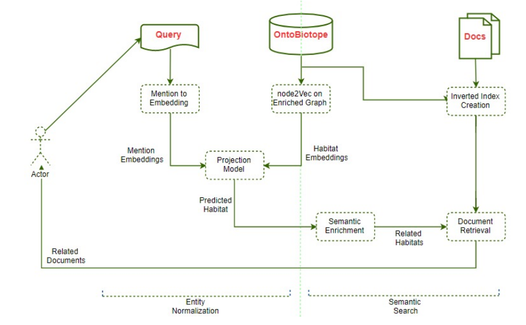

# Semantic Search of Bacteria Habitats on PubMed Abstracts via Ontology
Bacteria are a type of biological living-being that is present in most of the environments since the first life forms. The environments they can live in are called bacteria habitats. PubMed stores vast amount of research about bacteria and their habitats in free-text. The unstructured form of the free-text data creates challenges in querying and processing the existing knowledge base since the same information can be expressed in infinitely many different ways in natural languages. To search the literature and retrieve the relavant publications, we introduced a search method that leverages ontologies to structurally represent the information in PubMed abstracts on the bacteria habitat domain and use this structure to retrieve relevant PubMed abstracts to a user query.

To do so;
1. We learn a mapping from the bacteria habitat mentions in the
PubMed abstracts to the classes in a bacteria habitats ontology: OntoBiotope.
2. We build an index that maps each class in OntoBiotope to the abstracts they are mentioned. 

When a query is provided, we first utilize the learned mapping to map the query to an OntoBiotope class and then retrieve the related documents of this class by index. 
Thanks to the semantic structure and hierarchy in OntoBiotope, we can infer the other related habitats and retrieve documents that mention them as well. 

# Semantic Search of Bacteria Habitats on PubMed Abstracts via Ontology
> Utilizing an ontology to facilitate document search.

## Table of Contents
* [General Info](#general-information)
* [Technologies Used](#technologies-used)
* [Example Scnerios](#example-scnerios)
* [Project Status](#project-status)
* [Room for Improvement](#room-for-improvement)
* [Contact](#contact)
<!-- * [License](#license) -->

## General Information
Bacteria are a type of biological living-being that is present in most of the environments since the first life forms. The environments they can live in are called bacteria habitats. PubMed stores vast amount of research about bacteria and their habitats in free-text. The unstructured form of the free-text data creates challenges in querying and processing the existing knowledge base since the same information can be expressed in infinitely many different ways in natural languages. To search the literature and retrieve the relavant publications, we introduced a search method that leverages ontologies to structurally represent the information in PubMed abstracts on the bacteria habitat domain and use this structure to retrieve relevant PubMed abstracts to a user query.

To search unstructured PubMed abstracts, we follow a two-step methodology. 
- In the first step, our goal is to represent the abstracts in a more structured way. We use the annotated abstracts to serve our goal. We both learn a model to map free-text mentions to OntoBiotope classes and construct an index that maps OntoBiotope classes to the PubMed abstracts. The former lets us find the OntoBiotope class (i.e. bacteria habitat) that the query is relevant to, whereas the latter enables us to retrieve the abstracts that mention the relevant habitat. Note that the former one is called *entity normalization* since it maps differently expressed but semantically the same entities to the same ontology class, i.e.
normalize them.
- In the second step, we aim to leverage OntoBiotope to infer relevant habitats to enrich the search results. Given a user-defined query, we first map it to an OntoBiotope class by the mapping model to find the related bacteria habitat.
Then thanks to OntoBiotope, we find related habitats to the found one and enrich the search result. We display the abstracts that mention the mapped and related habitats to the user. We name this step as Semantic Search, since it utilizes the semantic hierarchy in OntoBiotope. The image below shows the flow of the methodology. To see the detailed analysis please check the [project report](./deliverables/Term_Project_Report.pdf).

## Technologies Used
- Python - version 3.8
- NetworkX - version 2.4

## Example Scnerios
- Query: brain damage
	> Search result without improvement:
		- bone fracture, wound
	> Search result with improvement:
		- bone fracture, drug resistant, head, pathogen, intensive care unit, blood, wound, central nervous system, patient, brain.
- Query: child with respiratory illness
	> Search result without improvement:
		- nasopharynx, throat, pharynx.
	> Search result with improvement:
		- nasopharynx, medical sample, human pathogen, microflora, respiratory tract, child, healthy person throat, welfare center, baby, hospital, infant, clinic, patient with infectious disease, pharynx, patient.

## Project Status
Project is: _no longer being worked on_

## Room for Improvement

- The proposed model can be improved different aspects. Firstly, using ontologies enables the merging of different types of data. During the analysis on GraphDB, we observed that different data sources can be integrated with OntoBiotope, to create a single and larger database. This means that one can use more and more data from different resources and linking them may result in more accurate search results, again from different resources. This would improve the semantic aspect of our work significantly.
- Secondly, the performance of the projection model is quite important to map queries to related habitats. In this work, the projection model is deliberately chosen as a simple matrix and it was observed that the model overfits the training data. Thus, smarter model selection processes are needed to improve
search performance.

## Contact
Created by [Rıza Özçelik](https://github.com/rizaozcelik) and [Selen Parlar](https://github.com/Pselen)